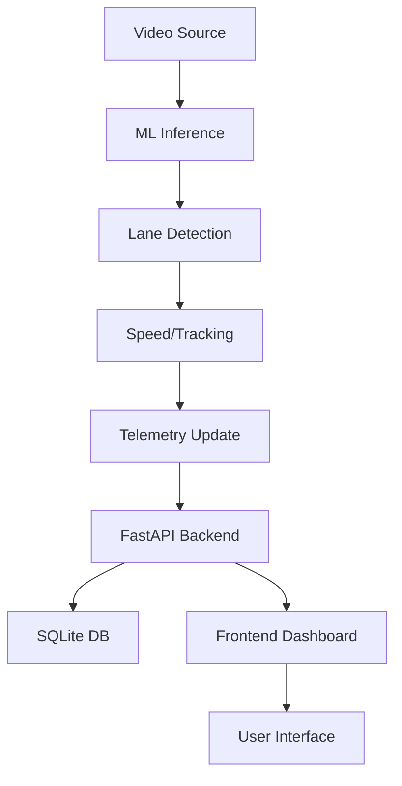

# System Architecture

## Overview
The Smart Traffic Intelligence Platform (STIP) is a distributed system consisting of three primary layers: Inference, Orchestration, and Visualization.

## 1. Inference Layer (`ml/`)
- **YOLOv11**: Detects and classifies vehicles (car, truck, bus, motorcycle).
- **Tracker**: Assigns unique IDs to vehicles and calculates trajectories.
- **Lane Engine**: 
    - Uses **Canny Edge Detection** to find road markings.
    - Uses **Hough Transform** to define lane boundaries.
    - Dynamically maps pixels to lanes (1-4).
- **Speed Estimator**: Calculates real-time speed based on pixel displacement over time.

## 2. Orchestration Layer (`backend/`)
- **FastAPI**: Handles high-concurrency telemetry updates from the ML engine.
- **SQLAlchemy/SQLite**: Stores historical traffic data (lane density, average speed, timestamps).
- **Analytics Service**: Computes congestion levels (Low/Medium/High) and signal timing recommendations.

## 3. Visualization Layer (`frontend/`)
- **Real-time Dashboard**: Displays live video streams and HUD overlays.
- **Traffic HUD**: Lane-by-lane metrics (Occupancy, Speed).
- **STCS Simulation**: A 3D-like CSS/JS simulation of an 8-lane intersection, synchronized with live backend state.

## Data Flow

